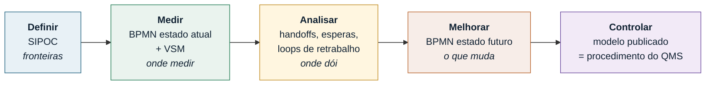

## Capítulo 40-A: BPMN 2.0 e Bizagi Modeler na prática

### A pergunta de engenharia

*Tenho um fluxograma do processo e toda a gente concorda que está certo. Porque é que, na primeira
reunião com a produção, aparecem três caminhos que o mapa não mostra?*

Porque o fluxograma não tem gramática. Um retângulo e uma seta significam o que o autor quiser que
signifiquem, e por isso um fluxograma consegue estar "certo" e ainda assim esconder: quem espera por
quem, o que acontece quando o cliente cancela a meio, o que dispara o processo, e o que acontece
quando duas coisas correm ao mesmo tempo.

A **BPMN — Business Process Model and Notation** existe para resolver exatamente isto. É uma norma
formal da OMG, atualmente na versão **2.0.2, publicada em janeiro de 2014**, que continua a ser a
versão vigente em 2026. Ela define não só as formas, mas a **semântica de execução** de cada uma:
dado um diagrama BPMN válido, não há ambiguidade sobre a ordem em que as coisas acontecem.

### Fluxograma, BPMN, VSM e SIPOC: qual usar

Esta é a decisão que se erra primeiro, e todas as outras dependem dela.

| Ferramenta | Responde a | Unidade | Quando usar |
|---|---|---|---|
| **SIPOC** | Quais são as fronteiras do processo? | O processo inteiro em 1 página | Fase **Definir**, primeira semana do projeto |
| **Fluxograma** | Qual é a sequência de passos? | Passo | Rascunho rápido, formação, processo simples e linear |
| **BPMN** | Quem faz o quê, quando, e o que corre mal? | Atividade + evento + gateway | Processo com várias áreas, exceções e esperas; base para automação |
| **VSM** | Onde está o tempo e o inventário? | Fluxo de material + fluxo de informação | Fase **Medir/Analisar** em Lean; foco em lead time e desperdício |

A regra prática: **se o processo atravessa mais do que um departamento ou tem exceções, é BPMN.**
Se a pergunta é sobre *tempo* e *estoque*, é VSM. As duas coexistem — não competem.

### Os quatro grupos de elementos

A BPMN 2.0 tem mais de 100 elementos gráficos. Ninguém precisa deles todos. A norma reconhece isso e
define um **subconjunto descritivo** (*Descriptive*) com cerca de 20 elementos, que cobre bem mais
de 90% dos processos de negócio. É esse subconjunto que interessa a um engenheiro da qualidade.

<figure class="figure2026">
<svg role="img" aria-label="Os quatro grupos de elementos BPMN: objetos de fluxo, objetos de conexão, raias e artefactos" viewBox="0 0 760 330" style="width:100%;height:auto;display:block;background:#fbfcfd;border:1px solid #dde5e9;border-radius:10px" xmlns="http://www.w3.org/2000/svg">
<defs>
<marker id="bpmn-arr" markerWidth="9" markerHeight="9" refX="7" refY="3" orient="auto"><path d="M0,0 L6,3 L0,6 Z" fill="#2b3f4a"/></marker>
<marker id="bpmn-open" markerWidth="10" markerHeight="10" refX="8" refY="3" orient="auto"><path d="M0,0 L7,3 L0,6" fill="none" stroke="#2b3f4a" stroke-width="1.2"/></marker>
</defs>
<text x="18" y="26" font-family="Segoe UI,sans-serif" font-size="13" font-weight="700" fill="#0f3a4a">1 · Objetos de fluxo — o que acontece</text>
<circle cx="52" cy="66" r="17" fill="#eaf6ea" stroke="#3d8a3d" stroke-width="2"/>
<text x="52" y="100" font-size="10.5" text-anchor="middle" fill="#334" font-family="Segoe UI,sans-serif">Evento início</text>
<circle cx="146" cy="66" r="17" fill="#fff8e8" stroke="#c08a1e" stroke-width="2"/><circle cx="146" cy="66" r="13" fill="none" stroke="#c08a1e" stroke-width="2"/>
<text x="146" y="100" font-size="10.5" text-anchor="middle" fill="#334" font-family="Segoe UI,sans-serif">Intermédio</text>
<circle cx="240" cy="66" r="17" fill="#fdeceb" stroke="#b03a30" stroke-width="3.5"/>
<text x="240" y="100" font-size="10.5" text-anchor="middle" fill="#334" font-family="Segoe UI,sans-serif">Evento fim</text>
<rect x="300" y="48" width="104" height="38" rx="7" fill="#e8f1f6" stroke="#20627f" stroke-width="2"/>
<text x="352" y="72" font-size="11" text-anchor="middle" fill="#123" font-family="Segoe UI,sans-serif">Atividade</text>
<text x="352" y="100" font-size="10.5" text-anchor="middle" fill="#334" font-family="Segoe UI,sans-serif">Tarefa / subprocesso</text>
<path d="M470,66 L494,44 L518,66 L494,88 Z" fill="#fff6e0" stroke="#c08a1e" stroke-width="2"/>
<text x="494" y="71" font-size="14" text-anchor="middle" fill="#7a5510" font-family="Segoe UI,sans-serif">&#215;</text>
<text x="494" y="100" font-size="10.5" text-anchor="middle" fill="#334" font-family="Segoe UI,sans-serif">Gateway</text>
<line x1="18" y1="120" x2="742" y2="120" stroke="#dde5e9"/>
<text x="18" y="146" font-family="Segoe UI,sans-serif" font-size="13" font-weight="700" fill="#0f3a4a">2 · Objetos de conexão — como se liga</text>
<line x1="30" y1="178" x2="150" y2="178" stroke="#2b3f4a" stroke-width="2" marker-end="url(#bpmn-arr)"/>
<text x="90" y="200" font-size="10.5" text-anchor="middle" fill="#334" font-family="Segoe UI,sans-serif">Fluxo de sequência</text>
<line x1="230" y1="178" x2="350" y2="178" stroke="#2b3f4a" stroke-width="1.6" stroke-dasharray="7 5" marker-end="url(#bpmn-open)"/>
<circle cx="230" cy="178" r="4" fill="#fff" stroke="#2b3f4a" stroke-width="1.4"/>
<text x="290" y="200" font-size="10.5" text-anchor="middle" fill="#334" font-family="Segoe UI,sans-serif">Fluxo de mensagem</text>
<line x1="430" y1="178" x2="550" y2="178" stroke="#7a8a94" stroke-width="1.4" stroke-dasharray="2 4"/>
<text x="490" y="200" font-size="10.5" text-anchor="middle" fill="#334" font-family="Segoe UI,sans-serif">Associação</text>
<line x1="18" y1="218" x2="742" y2="218" stroke="#dde5e9"/>
<text x="18" y="244" font-family="Segoe UI,sans-serif" font-size="13" font-weight="700" fill="#0f3a4a">3 · Raias — quem faz</text>
<rect x="24" y="256" width="300" height="56" fill="none" stroke="#20627f" stroke-width="1.6"/>
<rect x="24" y="256" width="26" height="56" fill="#e8f1f6" stroke="#20627f" stroke-width="1.6"/>
<text x="37" y="290" font-size="10" text-anchor="middle" fill="#123" font-family="Segoe UI,sans-serif" transform="rotate(-90 37 290)">Pool</text>
<line x1="50" y1="284" x2="324" y2="284" stroke="#20627f" stroke-width="1.2"/>
<text x="190" y="275" font-size="10" text-anchor="middle" fill="#456" font-family="Segoe UI,sans-serif">lane — Qualidade</text>
<text x="190" y="302" font-size="10" text-anchor="middle" fill="#456" font-family="Segoe UI,sans-serif">lane — Produção</text>
<text x="400" y="244" font-family="Segoe UI,sans-serif" font-size="13" font-weight="700" fill="#0f3a4a">4 · Artefactos — o que se anota</text>
<path d="M420,258 h44 l12,12 v40 h-56 z" fill="#fff" stroke="#7a8a94" stroke-width="1.4"/><path d="M464,258 v12 h12" fill="none" stroke="#7a8a94" stroke-width="1.4"/>
<text x="448" y="322" font-size="10" text-anchor="middle" fill="#456" font-family="Segoe UI,sans-serif">Objeto de dados</text>
<path d="M540,262 q-10,26 0,46" fill="none" stroke="#7a8a94" stroke-width="1.4"/>
<text x="600" y="288" font-size="10.5" fill="#456" font-family="Segoe UI,sans-serif">Anotação de texto</text>
</svg>
<figcaption>Os quatro grupos de elementos da BPMN 2.0. O subconjunto descritivo da norma limita-se
praticamente a estas formas — e é suficiente para modelar quase qualquer processo de qualidade.</figcaption>
</figure>

### Eventos: o que o fluxograma não sabe representar

Esta é a principal vantagem da BPMN sobre o fluxograma. Um fluxograma tem "início" e "fim". A BPMN
distingue **quando** o evento ocorre (início, intermédio, fim) e **o que** o dispara.

| Tipo | Símbolo interno | Significa | Exemplo na qualidade |
|---|---|---|---|
| Nenhum | vazio | Início/fim genérico | "Processo inicia" |
| **Mensagem** | envelope | Chega informação de fora | Reclamação do cliente entra |
| **Temporizador** | relógio | Espera ou prazo | "Aguardar 24 h de cura" |
| **Erro** | raio | Falha técnica do processo | Ensaio inválido |
| **Sinal** | triângulo | Difusão para todos | Paragem de linha (andon) |
| **Condicional** | folha pautada | Uma condição tornou-se verdadeira | Cpk cai abaixo de 1,33 |
| **Escalation** | seta para cima | Escalar para nível superior | NC não fechada em 5 dias |
| **Terminate** | círculo cheio | Mata todo o processo | Lote sucateado |

A distinção prática mais útil: um evento intermédio **desenhado no fluxo** interrompe e espera; um
evento intermédio **anexado à borda de uma atividade** (*boundary event*) representa o que pode
correr mal *durante* aquela atividade. É assim que se modela "se o ensaio falhar a meio, faz isto"
sem encher o diagrama de losangos.

### Gateways: a regra que quase toda a gente quebra

| Gateway | Símbolo | Semântica de divergência | Semântica de convergência |
|---|---|---|---|
| **Exclusivo (XOR)** | × | Escolhe **exatamente um** caminho | Passa assim que **um** chegar |
| **Paralelo (AND)** | + | Ativa **todos** os caminhos | **Espera por todos** |
| **Inclusivo (OR)** | ○ | Ativa **um ou mais** | Espera pelos que foram ativados |
| **Baseado em evento** | ⬠ com pentágono | Espera; ganha **o primeiro evento** que ocorrer | — |

Três regras de sintaxe que separam um diagrama BPMN correto de um desenho bonito:

1. **Um gateway decide ou junta — nunca faz trabalho.** Se o losango contém um verbo ("Verificar
   dimensão"), está errado: a verificação é uma *atividade*, e o gateway a seguir é que ramifica
   sobre o resultado.
2. **Quem abriu com AND tem de fechar com AND.** Abrir um paralelo e fechar com exclusivo faz o
   processo continuar com metade do trabalho por concluir — é o erro que gera "o relatório saiu sem
   o resultado do laboratório".
3. **Todo o caminho de saída de um XOR precisa de condição, e é preciso um *default*.** Sem o
   caminho por omissão, existe um estado em que o processo simplesmente para.

### Pools e lanes: a regra de ouro

- Uma **pool** é um participante autónomo (a nossa empresa, o cliente, o fornecedor, o laboratório
  externo). Cada pool tem o seu processo.
- Uma **lane** é uma divisão *dentro* da pool: um departamento, um papel, um sistema.

> **O fluxo de sequência (seta cheia) nunca atravessa a fronteira de uma pool. Entre pools só passa
> fluxo de mensagem (seta tracejada).**

Esta é a regra mais violada em auditorias de modelos. E não é formalismo: ela obriga a admitir que
não se controla o processo do fornecedor — só se lhe envia e dele se recebe mensagens. Modelos que
desenham setas cheias a atravessar pools escondem sistematicamente os tempos de espera entre
organizações, que é exatamente onde vive o lead time.

Quando o outro participante não interessa por dentro, usa-se uma **black-box pool**: um retângulo
vazio com o nome. É honesto e é suficiente.

### Exemplo resolvido: tratamento de não conformidade

Processo real de uma unidade fabril: peça reprovada na inspeção final. Três participantes —
Produção, Qualidade e o Cliente (black box). Repare em três coisas: o *boundary event* de
temporizador na disposição, o gateway paralelo que só fecha quando as duas pernas chegam, e o
fluxo de mensagem que atravessa para o cliente.

<figure class="figure2026">

<svg role="img" aria-label="Diagrama BPMN do processo de tratamento de nao conformidade, com pool Fabrica dividida nas lanes Producao e Qualidade e uma pool fechada do Cliente" viewBox="0 0 1240 640" xmlns="http://www.w3.org/2000/svg" style="width:100%;height:auto;display:block;min-width:760px"><defs><marker id="ar" markerWidth="9" markerHeight="9" refX="7.5" refY="3" orient="auto"><path d="M0,0 L6.5,3 L0,6 Z" fill="#2b3f4a"/></marker><marker id="aro" markerWidth="10" markerHeight="10" refX="8" refY="3" orient="auto"><path d="M0,0 L7,3 L0,6" fill="none" stroke="#2b3f4a" stroke-width="1.3"/></marker></defs><rect width="1240" height="640" fill="#fbfcfd"/><rect x="10" y="10" width="1220" height="490" fill="none" stroke="#8ea3ad" stroke-width="2"/><rect x="10" y="10" width="30" height="490" fill="#e6edf0" stroke="#8ea3ad" stroke-width="2"/><text x="25" y="235" font-family="Segoe UI, Inter, system-ui, sans-serif" font-size="12.5" font-weight="700" fill="#12303c" text-anchor="middle" transform="rotate(-90 25 235)">Fábrica  (pool)</text><rect x="40" y="10" width="1190" height="140" fill="#f7fafb" stroke="#8ea3ad" stroke-width="1.2"/><rect x="40" y="150" width="1190" height="350" fill="#fff" stroke="#8ea3ad" stroke-width="1.2"/><rect x="40" y="10" width="26" height="140" fill="#eef3f5" stroke="#8ea3ad" stroke-width="1.2"/><rect x="40" y="150" width="26" height="350" fill="#eef3f5" stroke="#8ea3ad" stroke-width="1.2"/><text x="53" y="80" font-family="Segoe UI, Inter, system-ui, sans-serif" font-size="11" font-weight="600" fill="#41606d" text-anchor="middle" transform="rotate(-90 53 80)">Produção</text><text x="53" y="325" font-family="Segoe UI, Inter, system-ui, sans-serif" font-size="11" font-weight="600" fill="#41606d" text-anchor="middle" transform="rotate(-90 53 325)">Qualidade</text><circle cx="112" cy="80" r="18" fill="#eaf6ea" stroke="#3d8a3d" stroke-width="2"/><text x="112" y="115.5" font-family="Segoe UI, Inter, system-ui, sans-serif" font-size="9.6" font-weight="400" fill="#3a5560" text-anchor="middle">Peça reprovada na</text><text x="112" y="127.5" font-family="Segoe UI, Inter, system-ui, sans-serif" font-size="9.6" font-weight="400" fill="#3a5560" text-anchor="middle">inspeção</text><rect x="170" y="52" width="132" height="56" rx="7" fill="#e8f1f6" stroke="#20627f" stroke-width="1.7"/><text x="236.0" y="77.3" font-family="Segoe UI, Inter, system-ui, sans-serif" font-size="11" font-weight="400" fill="#12303c" text-anchor="middle">Segregar e</text><text x="236.0" y="90.7" font-family="Segoe UI, Inter, system-ui, sans-serif" font-size="11" font-weight="400" fill="#12303c" text-anchor="middle">identificar a peça</text><text x="177" y="65" font-family="Segoe UI, Inter, system-ui, sans-serif" font-size="9.5" font-weight="700" fill="#20627f" opacity=".75">A1</text><rect x="800" y="52" width="132" height="56" rx="7" fill="#e8f1f6" stroke="#20627f" stroke-width="1.7"/><text x="866.0" y="77.3" font-family="Segoe UI, Inter, system-ui, sans-serif" font-size="11" font-weight="400" fill="#12303c" text-anchor="middle">Executar ação</text><text x="866.0" y="90.7" font-family="Segoe UI, Inter, system-ui, sans-serif" font-size="11" font-weight="400" fill="#12303c" text-anchor="middle">corretiva</text><text x="807" y="65" font-family="Segoe UI, Inter, system-ui, sans-serif" font-size="9.5" font-weight="700" fill="#20627f" opacity=".75">A6</text><rect x="170" y="197" width="132" height="56" rx="7" fill="#e8f1f6" stroke="#20627f" stroke-width="1.7"/><text x="236.0" y="222.3" font-family="Segoe UI, Inter, system-ui, sans-serif" font-size="11" font-weight="400" fill="#12303c" text-anchor="middle">Registar e</text><text x="236.0" y="235.7" font-family="Segoe UI, Inter, system-ui, sans-serif" font-size="11" font-weight="400" fill="#12303c" text-anchor="middle">classificar a NC</text><text x="177" y="210" font-family="Segoe UI, Inter, system-ui, sans-serif" font-size="9.5" font-weight="700" fill="#20627f" opacity=".75">A2</text><path d="M339,225 L362,202 L385,225 L362,248 Z" fill="#fff6e0" stroke="#c08a1e" stroke-width="1.7"/><path d="M352.34,215.34 L371.66,234.66 M371.66,215.34 L352.34,234.66" stroke="#8a6112" stroke-width="2.4" stroke-linecap="round" fill="none"/><text x="362" y="184.5" font-family="Segoe UI, Inter, system-ui, sans-serif" font-size="9.6" font-weight="400" fill="#3a5560" text-anchor="middle">Desvio aceitável?</text><rect x="424" y="197" width="132" height="56" rx="7" fill="#e8f1f6" stroke="#20627f" stroke-width="1.7"/><text x="490.0" y="222.3" font-family="Segoe UI, Inter, system-ui, sans-serif" font-size="11" font-weight="400" fill="#12303c" text-anchor="middle">Analisar</text><text x="490.0" y="235.7" font-family="Segoe UI, Inter, system-ui, sans-serif" font-size="11" font-weight="400" fill="#12303c" text-anchor="middle">causa-raiz</text><text x="431" y="210" font-family="Segoe UI, Inter, system-ui, sans-serif" font-size="9.5" font-weight="700" fill="#20627f" opacity=".75">A3</text><path d="M589,225 L612,202 L635,225 L612,248 Z" fill="#fff6e0" stroke="#c08a1e" stroke-width="1.7"/><path d="M600.5,225 L623.5,225 M612,213.5 L612,236.5" stroke="#8a6112" stroke-width="2.4" stroke-linecap="round" fill="none"/><rect x="662" y="160" width="130" height="50" rx="7" fill="#e8f1f6" stroke="#20627f" stroke-width="1.7"/><text x="727.0" y="182.3" font-family="Segoe UI, Inter, system-ui, sans-serif" font-size="11" font-weight="400" fill="#12303c" text-anchor="middle">Avaliar lotes em</text><text x="727.0" y="195.7" font-family="Segoe UI, Inter, system-ui, sans-serif" font-size="11" font-weight="400" fill="#12303c" text-anchor="middle">curso</text><text x="669" y="173" font-family="Segoe UI, Inter, system-ui, sans-serif" font-size="9.5" font-weight="700" fill="#20627f" opacity=".75">A4</text><rect x="662" y="240" width="130" height="50" rx="7" fill="#e8f1f6" stroke="#20627f" stroke-width="1.7"/><text x="727.0" y="262.3" font-family="Segoe UI, Inter, system-ui, sans-serif" font-size="11" font-weight="400" fill="#12303c" text-anchor="middle">Definir ação</text><text x="727.0" y="275.7" font-family="Segoe UI, Inter, system-ui, sans-serif" font-size="11" font-weight="400" fill="#12303c" text-anchor="middle">corretiva</text><text x="669" y="253" font-family="Segoe UI, Inter, system-ui, sans-serif" font-size="9.5" font-weight="700" fill="#20627f" opacity=".75">A5</text><path d="M835,225 L858,202 L881,225 L858,248 Z" fill="#fff6e0" stroke="#c08a1e" stroke-width="1.7"/><path d="M846.5,225 L869.5,225 M858,213.5 L858,236.5" stroke="#8a6112" stroke-width="2.4" stroke-linecap="round" fill="none"/><rect x="1000" y="197" width="120" height="56" rx="7" fill="#e8f1f6" stroke="#20627f" stroke-width="1.7"/><text x="1060.0" y="229.0" font-family="Segoe UI, Inter, system-ui, sans-serif" font-size="11" font-weight="400" fill="#12303c" text-anchor="middle">Verificar eficácia</text><text x="1007" y="210" font-family="Segoe UI, Inter, system-ui, sans-serif" font-size="9.5" font-weight="700" fill="#20627f" opacity=".75">A7</text><circle cx="1185" cy="225" r="18" fill="#fdeceb" stroke="#b03a30" stroke-width="3.6"/><text x="1185" y="265.5" font-family="Segoe UI, Inter, system-ui, sans-serif" font-size="9.6" font-weight="400" fill="#3a5560" text-anchor="middle">NC fechada</text><rect x="424" y="350" width="150" height="56" rx="7" fill="#e8f1f6" stroke="#20627f" stroke-width="1.7"/><text x="499.0" y="375.3" font-family="Segoe UI, Inter, system-ui, sans-serif" font-size="11" font-weight="400" fill="#12303c" text-anchor="middle">Pedir concessão ao</text><text x="499.0" y="388.7" font-family="Segoe UI, Inter, system-ui, sans-serif" font-size="11" font-weight="400" fill="#12303c" text-anchor="middle">cliente</text><text x="431" y="363" font-family="Segoe UI, Inter, system-ui, sans-serif" font-size="9.5" font-weight="700" fill="#20627f" opacity=".75">A8</text><circle cx="574" cy="406" r="13" fill="#fff" stroke="#c08a1e" stroke-width="1.8"/><circle cx="574" cy="406" r="9.6" fill="none" stroke="#c08a1e" stroke-width="1.5"/><path d="M574,400.5 L574,406 L578,408.5" stroke="#8a6112" stroke-width="1.6" fill="none" stroke-linecap="round"/><text x="668" y="453.4" font-family="Segoe UI, Inter, system-ui, sans-serif" font-size="9.4" font-weight="400" fill="#8a6112" text-anchor="middle">5 dias sem resposta</text><circle cx="790" cy="466" r="17" fill="#fdeceb" stroke="#b03a30" stroke-width="3.6"/><path d="M790,458 L796,473 L790,467 L784,473 Z" fill="#b03a30"/><text x="790" y="497.4" font-family="Segoe UI, Inter, system-ui, sans-serif" font-size="9.4" font-weight="400" fill="#3a5560" text-anchor="middle">Escalar</text><circle cx="1010" cy="378" r="17" fill="#fdeceb" stroke="#b03a30" stroke-width="3.6"/><text x="1010" y="409.5" font-family="Segoe UI, Inter, system-ui, sans-serif" font-size="9.4" font-weight="400" fill="#3a5560" text-anchor="middle">Fechada por</text><text x="1010" y="421.3" font-family="Segoe UI, Inter, system-ui, sans-serif" font-size="9.4" font-weight="400" fill="#3a5560" text-anchor="middle">concessão</text><rect x="330" y="540" width="300" height="58" fill="#eceff1" stroke="#8ea3ad" stroke-width="2"/><rect x="330" y="540" width="28" height="58" fill="#dde4e8" stroke="#8ea3ad" stroke-width="2"/><text x="344" y="569" font-family="Segoe UI, Inter, system-ui, sans-serif" font-size="10.5" font-weight="700" fill="#12303c" text-anchor="middle" transform="rotate(-90 344 569)">Cliente</text><text x="500" y="565" font-family="Segoe UI, Inter, system-ui, sans-serif" font-size="11.5" font-weight="600" fill="#3b5560" text-anchor="middle">pool fechada (black box)</text><text x="500" y="581" font-family="Segoe UI, Inter, system-ui, sans-serif" font-size="9.6" fill="#63808d" text-anchor="middle">o processo dele não nos pertence</text><path d="M130,80 L170,80" fill="none" stroke="#2b3f4a" stroke-width="1.9" marker-end="url(#ar)"/><path d="M236,108 L236,197" fill="none" stroke="#2b3f4a" stroke-width="1.9" marker-end="url(#ar)"/><path d="M302,225 L339,225" fill="none" stroke="#2b3f4a" stroke-width="1.9" marker-end="url(#ar)"/><path d="M385,225 L424,225" fill="none" stroke="#2b3f4a" stroke-width="1.9" marker-end="url(#ar)"/><rect x="358.4" y="244" width="91.2" height="15" rx="3" fill="#fff" opacity=".92"/><text x="404" y="255.5" font-family="Segoe UI, Inter, system-ui, sans-serif" font-size="10" fill="#3b5560" text-anchor="middle">não (default)</text><path d="M556,225 L589,225" fill="none" stroke="#2b3f4a" stroke-width="1.9" marker-end="url(#ar)"/><path d="M612,202 L612,185 L662,185" fill="none" stroke="#2b3f4a" stroke-width="1.9" marker-end="url(#ar)"/><path d="M612,248 L612,265 L662,265" fill="none" stroke="#2b3f4a" stroke-width="1.9" marker-end="url(#ar)"/><path d="M792,185 L835,185 L835,208" fill="none" stroke="#2b3f4a" stroke-width="1.9" marker-end="url(#ar)"/><path d="M792,265 L835,265 L835,242" fill="none" stroke="#2b3f4a" stroke-width="1.9" marker-end="url(#ar)"/><path d="M858,202 L858,108" fill="none" stroke="#2b3f4a" stroke-width="1.9" marker-end="url(#ar)"/><path d="M932,80 L962,80 L962,225 L1000,225" fill="none" stroke="#2b3f4a" stroke-width="1.9" marker-end="url(#ar)"/><path d="M1120,225 L1167,225" fill="none" stroke="#2b3f4a" stroke-width="1.9" marker-end="url(#ar)"/><path d="M362,248 L362,378 L424,378" fill="none" stroke="#2b3f4a" stroke-width="1.9" marker-end="url(#ar)"/><rect x="322.4" y="306" width="27.200000000000003" height="15" rx="3" fill="#fff" opacity=".92"/><text x="336" y="317.5" font-family="Segoe UI, Inter, system-ui, sans-serif" font-size="10" fill="#3b5560" text-anchor="middle">sim</text><path d="M574,378 L993,378" fill="none" stroke="#2b3f4a" stroke-width="1.9" marker-end="url(#ar)"/><path d="M574,419 L574,466 L773,466" fill="none" stroke="#2b3f4a" stroke-width="1.9" marker-end="url(#ar)"/><circle cx="462" cy="406" r="4" fill="#fff" stroke="#2b3f4a" stroke-width="1.5"/><path d="M462,406 L462,540" fill="none" stroke="#2b3f4a" stroke-width="1.6" stroke-dasharray="7 5" marker-end="url(#aro)"/><text x="432" y="480" font-family="Segoe UI, Inter, system-ui, sans-serif" font-size="9.8" fill="#3b5560" text-anchor="middle">pedido</text><circle cx="524" cy="540" r="4" fill="#fff" stroke="#2b3f4a" stroke-width="1.5"/><path d="M524,540 L524,406" fill="none" stroke="#2b3f4a" stroke-width="1.6" stroke-dasharray="7 5" marker-end="url(#aro)"/><text x="558" y="480" font-family="Segoe UI, Inter, system-ui, sans-serif" font-size="9.8" fill="#3b5560" text-anchor="middle">resposta</text><text x="40" y="628" font-family="Segoe UI, Inter, system-ui, sans-serif" font-size="10" fill="#63808d">Seta cheia = fluxo de sequência (só dentro da pool)   ·   seta tracejada com círculo = fluxo de mensagem (única ligação permitida entre pools)   ·   ◇ com × = XOR   ·   ◇ com + = AND   ·   ⏱ na borda = evento de fronteira (temporizador)</text></svg>

<figcaption>Processo de tratamento de nao conformidade em BPMN 2.0. A pool <b>Fábrica</b> tem duas lanes; o <b>Cliente</b> é uma pool fechada, ligada apenas por fluxo de mensagem. Note o evento de fronteira de temporizador em A8: ele modela o prazo sem encher o diagrama de losangos.</figcaption>
</figure>

**O que este modelo revela e o fluxograma equivalente esconderia:**

- A avaliação de impacto nos lotes em curso (A4) e o pedido de concessão (A5) correm **em paralelo**.
  Num fluxograma sequencial, alguém acabaria por os pôr em série e o lead time do processo subiria
  sem nenhuma razão técnica.
- A espera pela resposta do cliente é **tempo que não controlamos**. Ao ficar do outro lado de uma
  fronteira de pool, ela deixa de se confundir com trabalho interno — e passa a ser mensurável como
  espera, que é o que interessa ao VSM.
- O caminho "desvio aceitável = sim" salta a análise de causa-raiz. Ver isso desenhado costuma ser
  desconfortável, e é frequentemente a primeira melhoria que o projeto encontra.

### Bizagi Modeler: como usar na prática

O Bizagi Modeler é uma aplicação de modelação BPMN com um nível gratuito que permite modelar e
documentar processos sem limite de número de modelos, guardando os ficheiros localmente, e exportar
a documentação para Word ou PDF. É a escolha habitual em ambiente industrial em Portugal e no Brasil
por três razões práticas: valida a sintaxe BPMN enquanto se desenha, gera a documentação do processo
automaticamente a partir do modelo, e permite simulação.

**O fluxo de trabalho que recomendo:**

1. **Desenhar a pool principal primeiro, sem lanes.** Só a sequência das atividades. Resistir à
   tentação de organizar por departamento antes de a sequência estar certa.
2. **Só depois introduzir as lanes** e arrastar cada atividade para a sua. É neste momento que
   aparecem as transferências entre áreas — cada seta que cruza uma lane é um *handoff*, e cada
   handoff é um candidato a atraso e a erro. **Contar os handoffs é uma métrica de projeto.**
3. **Acrescentar os eventos de exceção por último**, perguntando a cada atividade: "o que pode
   correr mal aqui, e quem é que fica a saber?"
4. **Documentar as atividades dentro do Bizagi** (descrição, responsável, recursos, tempos). É esse
   preenchimento que transforma o desenho em documento de sistema de gestão.
5. **Exportar para Word/PDF** para o dossiê do projeto e para a documentação do QMS.

**Os quatro níveis de simulação do Bizagi** e para que servem num projeto Six Sigma:

| Nível | O que adiciona | Responde a |
|---|---|---|
| 1 — Validação de processo | Só a topologia e as probabilidades dos gateways | O modelo é sintaticamente válido? Por onde passa o trabalho? |
| 2 — Análise de tempo | Duração de cada atividade | Qual é o **lead time** teórico? Onde está o tempo? |
| 3 — Análise de recursos | Recursos e sua disponibilidade | Onde está o **gargalo**? Onde se forma fila? |
| 4 — Análise de calendário | Turnos, feriados, chegadas reais | Qual é o desempenho **na semana real**, não na média? |

O nível 3 é o que costuma pagar o esforço: mostra que o gargalo raramente está na atividade mais
demorada, mas na que tem menos recurso disponível.

> **Nota de licenciamento.** Confirme sempre no site do fabricante o que o nível gratuito inclui no
> momento em que for usar — as condições comerciais mudam. Alternativas de notação idêntica:
> **Camunda Modeler** e **bpmn.io** (ambos gratuitos e de código aberto, com BPMN 2.0 XML nativo),
> e **draw.io** para desenho rápido sem validação semântica.

### BPMN vs. EPC vs. fluxograma simples: três notações, três públicos

Nem todo mapa precisa de BPMN. A pergunta a fazer antes de abrir o Bizagi é "quem vai ler isto, e
para quê" — as três notações mais comuns em ambiente industrial resolvem problemas diferentes:

| Notação | Elementos | Para quem | Ponto forte | Ponto fraco |
|---|---|---|---|---|
| **Fluxograma simples** | Início/fim, atividade, decisão | Diretoria, comunicação rápida | Qualquer pessoa lê em 10 segundos | Não representa exceções, tempo ou responsável com rigor |
| **EPC** (Event-driven Process Chain) | Evento → função → evento, conectores lógicos E/OU | Ambientes SAP/ERP, arquitetura de processos | Liga processo a sistema de informação de forma nativa | Menos difundida fora do ecossistema SAP; sem semântica de execução |
| **BPMN 2.0** | Eventos, atividades, gateways, raias, artefactos | Analistas de processo, TI, automação | Padrão internacional, base para automação (RPA/BPMS) | Curva de aprendizagem maior; excesso de detalhe assusta público não técnico |

A prática mais eficaz não é escolher uma e abandonar as outras — é traduzir entre elas conforme a
audiência muda: **fluxograma simples para aprovar com a diretoria**, **BPMN completo para a equipa
de projeto e para TI**. O erro comum é mostrar o BPMN completo, com todas as exceções e gateways,
numa reunião de aprovação executiva — a reação típica é "isto está complicado demais", quando o
problema não é o processo, é o nível de detalhe errado para aquela plateia.

### Mapeamento vs. modelagem: dois níveis de detalhe, dois objetivos

"Mapear o processo" e "modelar o processo" são usados como sinónimos, mas descrevem etapas
diferentes de maturidade:

| | Mapeamento | Modelagem |
|---|---|---|
| **O que é** | Levantamento manual do fluxo real — post-its, entrevistas, cronómetro | Representação formal e padronizada, normalmente em ferramenta (BPMN/Bizagi) |
| **Fonte** | Observação direta e entrevista com quem executa | O mapeamento já validado, redesenhado com notação e regras formais |
| **Formato típico** | Post-its num quadro, rascunho, checklist | Diagrama BPMN com raias, gateways, eventos, exportável e versionável |
| **Serve para** | Entender o processo real, capturar variação e exceção que ninguém documentou | Comunicar, documentar formalmente, servir de base para automação |

A sequência que funciona é sempre a mesma: **mapear primeiro (sujo, manual, no gemba), modelar
depois (limpo, formal, na ferramenta)**. Pular direto para a modelagem — abrir o Bizagi sem ter
caminhado o processo com quem o executa — é a causa mais comum de mapas bonitos que não descrevem
nada real. É o mesmo erro do primeiro item da lista de "Erros comuns" mais abaixo, só que cometido
antes mesmo de a ferramenta entrar em cena.

### Onde o mapeamento entra no DMAIC

O ponto que fecha o ciclo: em **Controlar**, o modelo BPMN do estado futuro deixa de ser um artefacto
do projeto e passa a ser o **procedimento documentado** do sistema de gestão. Se o modelo e o
procedimento escrito divergirem, a auditoria encontra os dois e nenhum vale. Modelar bem em Melhorar
é o que evita reescrever tudo em Controlar.

### Métricas que se extraem de um mapa (e que quase ninguém extrai)

Um mapa que não produz números é um desenho. Destes quatro, os dois primeiros saem por contagem
direta e valem a pena em qualquer projeto:

| Métrica | Como se calcula no mapa | Por que importa |
|---|---|---|
| **Handoffs** | Número de setas que cruzam uma lane ou pool | Cada transferência é um ponto de atraso e de perda de informação |
| **Pontos de decisão** | Número de gateways XOR/OR | Complexidade percebida; alvo direto de simplificação |
| **Rácio de valor acrescentado** | Σ tempo VA ÷ lead time total | A métrica-mãe do Lean; tipicamente 1–5% em processos administrativos |
| **Loops de retrabalho** | Setas que voltam a montante | Cada loop é retrabalho oculto que não aparece no custo padrão |

### Erros comuns

1. **Modelar o processo como deveria ser em vez de como é.** O estado atual tem de doer. Se o mapa
   do estado atual é limpo, foi desenhado na sala errada — a modelação faz-se com quem executa.
2. **Um só nível de detalhe para tudo.** Use subprocessos colapsados. Um diagrama que não cabe num
   ecrã sem *zoom* não vai ser lido por ninguém.
3. **Gateways com verbos.** Já referido, mas é o erro nº 1 em modelos reais.
4. **Setas cheias entre pools.** Esconde a espera entre organizações.
5. **Confundir lane com pool.** Se o participante tem processo próprio e não recebe ordens nossas,
   é pool, não lane. O fornecedor não é uma lane da nossa fábrica.
6. **Modelar sem verbo no infinitivo.** "Ordem de compra" não é uma atividade; "Emitir ordem de
   compra" é. A regra do Capítulo 40 — começar sempre por um verbo de ação — aplica-se igualmente à
   BPMN.
7. **Parar no desenho.** O mapa sem métricas extraídas não mudou nada. Conte os handoffs.

### Ligações

- **Capítulo 5** — SIPOC define as fronteiras antes de se modelar o interior.
- **Capítulo 27** — VSM mede tempo e inventário; BPMN mede lógica e responsabilidade.
- **Capítulo 40** — a simbologia clássica de fluxograma e swimlane que a BPMN formaliza.
- **Capítulo 35 (Medir)** — o mapa define onde os dados podem e devem ser recolhidos.
- **Capítulo 89** — documentação do sistema da qualidade: o modelo publicado como procedimento.
