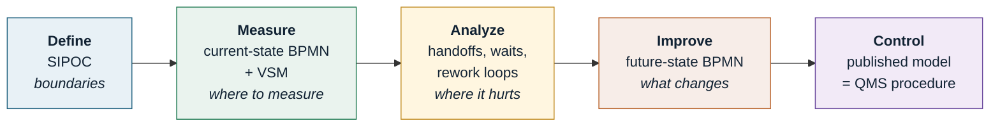

## Chapter 900: BPMN 2.0 and Bizagi Modeler in Practice

### The engineering question

*I have a flowchart of the process and everyone agrees it's correct. Why do three paths the map
doesn't show show up in the first meeting with production?*

Because a flowchart has no grammar. A rectangle and an arrow mean whatever the author wants them to
mean, so a flowchart can be "correct" and still hide: who waits for whom, what happens when the
customer cancels midway, what triggers the process, and what happens when two things happen at the
same time.

**BPMN — Business Process Model and Notation** exists to solve exactly this. It's a formal OMG
standard, currently at version **2.0.2, published in January 2014**, which remains the current
version in 2026. It defines not just the shapes, but the **execution semantics** of each one: given
a valid BPMN diagram, there's no ambiguity about the order in which things happen.

### Flowchart, BPMN, VSM and SIPOC: which one to use

This is the decision people get wrong first, and every other decision depends on it.

| Tool | Answers | Unit | When to use |
|---|---|---|---|
| **SIPOC** | What are the process boundaries? | The whole process on 1 page | **Define** phase, first week of the project |
| **Flowchart** | What's the sequence of steps? | Step | Quick sketch, training, simple linear process |
| **BPMN** | Who does what, when, and what can go wrong? | Activity + event + gateway | Cross-functional process with exceptions and waits; basis for automation |
| **VSM** | Where is the time and the inventory? | Material flow + information flow | **Measure/Analyze** phase in Lean; focus on lead time and waste |

The practical rule: **if the process crosses more than one department or has exceptions, it's
BPMN.** If the question is about *time* and *inventory*, it's VSM. The two coexist — they don't
compete.

### The four groups of elements

BPMN 2.0 has over 100 graphical elements. Nobody needs all of them. The standard recognizes this and
defines a **Descriptive** subset of about 20 elements, which covers well over 90% of business
processes. That's the subset that matters to a quality engineer.

<figure class="figure2026">
<svg role="img" aria-label="The four groups of BPMN elements: flow objects, connecting objects, lanes, and artifacts" viewBox="0 0 760 330" style="width:100%;height:auto;display:block;background:#fbfcfd;border:1px solid #dde5e9;border-radius:10px" xmlns="http://www.w3.org/2000/svg">
<defs>
<marker id="bpmn-arr" markerWidth="9" markerHeight="9" refX="7" refY="3" orient="auto"><path d="M0,0 L6,3 L0,6 Z" fill="#2b3f4a"/></marker>
<marker id="bpmn-open" markerWidth="10" markerHeight="10" refX="8" refY="3" orient="auto"><path d="M0,0 L7,3 L0,6" fill="none" stroke="#2b3f4a" stroke-width="1.2"/></marker>
</defs>
<text x="18" y="26" font-family="Segoe UI,sans-serif" font-size="13" font-weight="700" fill="#0f3a4a">1 &#183; Flow objects — what happens</text>
<circle cx="52" cy="66" r="17" fill="#eaf6ea" stroke="#3d8a3d" stroke-width="2"/>
<text x="52" y="100" font-size="10.5" text-anchor="middle" fill="#334" font-family="Segoe UI,sans-serif">Start event</text>
<circle cx="146" cy="66" r="17" fill="#fff8e8" stroke="#c08a1e" stroke-width="2"/><circle cx="146" cy="66" r="13" fill="none" stroke="#c08a1e" stroke-width="2"/>
<text x="146" y="100" font-size="10.5" text-anchor="middle" fill="#334" font-family="Segoe UI,sans-serif">Intermediate</text>
<circle cx="240" cy="66" r="17" fill="#fdeceb" stroke="#b03a30" stroke-width="3.5"/>
<text x="240" y="100" font-size="10.5" text-anchor="middle" fill="#334" font-family="Segoe UI,sans-serif">End event</text>
<rect x="300" y="48" width="104" height="38" rx="7" fill="#e8f1f6" stroke="#20627f" stroke-width="2"/>
<text x="352" y="72" font-size="11" text-anchor="middle" fill="#123" font-family="Segoe UI,sans-serif">Activity</text>
<text x="352" y="100" font-size="10.5" text-anchor="middle" fill="#334" font-family="Segoe UI,sans-serif">Task / sub-process</text>
<path d="M470,66 L494,44 L518,66 L494,88 Z" fill="#fff6e0" stroke="#c08a1e" stroke-width="2"/>
<text x="494" y="71" font-size="14" text-anchor="middle" fill="#7a5510" font-family="Segoe UI,sans-serif">&#215;</text>
<text x="494" y="100" font-size="10.5" text-anchor="middle" fill="#334" font-family="Segoe UI,sans-serif">Gateway</text>
<line x1="18" y1="120" x2="742" y2="120" stroke="#dde5e9"/>
<text x="18" y="146" font-family="Segoe UI,sans-serif" font-size="13" font-weight="700" fill="#0f3a4a">2 &#183; Connecting objects — how things link</text>
<line x1="30" y1="178" x2="150" y2="178" stroke="#2b3f4a" stroke-width="2" marker-end="url(#bpmn-arr)"/>
<text x="90" y="200" font-size="10.5" text-anchor="middle" fill="#334" font-family="Segoe UI,sans-serif">Sequence flow</text>
<line x1="230" y1="178" x2="350" y2="178" stroke="#2b3f4a" stroke-width="1.6" stroke-dasharray="7 5" marker-end="url(#bpmn-open)"/>
<circle cx="230" cy="178" r="4" fill="#fff" stroke="#2b3f4a" stroke-width="1.4"/>
<text x="290" y="200" font-size="10.5" text-anchor="middle" fill="#334" font-family="Segoe UI,sans-serif">Message flow</text>
<line x1="430" y1="178" x2="550" y2="178" stroke="#7a8a94" stroke-width="1.4" stroke-dasharray="2 4"/>
<text x="490" y="200" font-size="10.5" text-anchor="middle" fill="#334" font-family="Segoe UI,sans-serif">Association</text>
<line x1="18" y1="218" x2="742" y2="218" stroke="#dde5e9"/>
<text x="18" y="244" font-family="Segoe UI,sans-serif" font-size="13" font-weight="700" fill="#0f3a4a">3 &#183; Lanes — who does it</text>
<rect x="24" y="256" width="300" height="56" fill="none" stroke="#20627f" stroke-width="1.6"/>
<rect x="24" y="256" width="26" height="56" fill="#e8f1f6" stroke="#20627f" stroke-width="1.6"/>
<text x="37" y="290" font-size="10" text-anchor="middle" fill="#123" font-family="Segoe UI,sans-serif" transform="rotate(-90 37 290)">Pool</text>
<line x1="50" y1="284" x2="324" y2="284" stroke="#20627f" stroke-width="1.2"/>
<text x="190" y="275" font-size="10" text-anchor="middle" fill="#456" font-family="Segoe UI,sans-serif">lane — Quality</text>
<text x="190" y="302" font-size="10" text-anchor="middle" fill="#456" font-family="Segoe UI,sans-serif">lane — Production</text>
<text x="400" y="244" font-family="Segoe UI,sans-serif" font-size="13" font-weight="700" fill="#0f3a4a">4 &#183; Artifacts — what gets annotated</text>
<path d="M420,258 h44 l12,12 v40 h-56 z" fill="#fff" stroke="#7a8a94" stroke-width="1.4"/><path d="M464,258 v12 h12" fill="none" stroke="#7a8a94" stroke-width="1.4"/>
<text x="448" y="322" font-size="10" text-anchor="middle" fill="#456" font-family="Segoe UI,sans-serif">Data object</text>
<path d="M540,262 q-10,26 0,46" fill="none" stroke="#7a8a94" stroke-width="1.4"/>
<text x="600" y="288" font-size="10.5" fill="#456" font-family="Segoe UI,sans-serif">Text annotation</text>
</svg>
<figcaption>The four groups of BPMN 2.0 elements. The standard's descriptive subset is essentially
limited to these shapes — and it's enough to model almost any quality process.</figcaption>
</figure>

### Events: what a flowchart can't represent

This is BPMN's main advantage over a flowchart. A flowchart has "start" and "end." BPMN
distinguishes **when** the event occurs (start, intermediate, end) and **what** triggers it.

| Type | Inner symbol | Means | Example in quality |
|---|---|---|---|
| None | empty | Generic start/end | "Process starts" |
| **Message** | envelope | Information arrives from outside | A customer complaint comes in |
| **Timer** | clock | Wait or deadline | "Wait 24 h for cure" |
| **Error** | lightning bolt | Technical failure of the process | Invalid test |
| **Signal** | triangle | Broadcast to everyone | Line stop (andon) |
| **Conditional** | ruled sheet | A condition became true | Cpk drops below 1.33 |
| **Escalation** | upward arrow | Escalate to a higher level | NC not closed within 5 days |
| **Terminate** | filled circle | Kills the whole process | Lot scrapped |

The most useful practical distinction: an intermediate event **drawn in the flow** interrupts and
waits; an intermediate event **attached to the boundary of an activity** (*boundary event*)
represents what can go wrong *during* that activity. That's how you model "if the test fails
midway, do this" without cluttering the diagram with diamonds.

### Gateways: the rule almost everyone breaks

| Gateway | Symbol | Divergence semantics | Convergence semantics |
|---|---|---|---|
| **Exclusive (XOR)** | × | Chooses **exactly one** path | Passes as soon as **one** arrives |
| **Parallel (AND)** | + | Activates **all** paths | **Waits for all** |
| **Inclusive (OR)** | ○ | Activates **one or more** | Waits for the ones that were activated |
| **Event-based** | pentagon | Waits; **the first event** to occur wins | — |

Three syntax rules that separate a correct BPMN diagram from a pretty drawing:

1. **A gateway decides or merges — it never does work.** If the diamond contains a verb ("Check
   dimension"), it's wrong: the check is an *activity*, and the gateway right after it branches on
   the result.
2. **Whoever opened with AND has to close with AND.** Opening a parallel split and closing it with
   an exclusive merge lets the process continue with half the work unfinished — it's the error
   behind "the report went out without the lab result."
3. **Every outgoing path of an XOR needs a condition, and there has to be a *default*.** Without
   the default path, there's a state where the process simply stops.

### Pools and lanes: the golden rule

- A **pool** is an autonomous participant (our company, the customer, the supplier, the outside
  lab). Each pool has its own process.
- A **lane** is a division *within* a pool: a department, a role, a system.

> **The sequence flow (solid arrow) never crosses a pool boundary. Between pools, only message
> flow (dashed arrow) is allowed.**

This is the most frequently violated rule in model audits. And it isn't formalism: it forces you to
admit that you don't control the supplier's process — you can only send messages to it and receive
messages from it. Models that draw solid arrows crossing pools systematically hide the waiting time
between organizations, which is exactly where lead time lives.

When the other participant's internals don't matter, use a **black-box pool**: an empty rectangle
with a name. It's honest, and it's enough.

### Worked example: nonconformity handling

Real process from a manufacturing plant: a part is rejected at final inspection. Three
participants — Production, Quality, and the Customer (black box). Notice three things: the timer
*boundary event* on the layout, the parallel gateway that only closes once both legs arrive, and
the message flow that crosses over to the customer.

<figure class="figure2026">

<svg role="img" aria-label="BPMN diagram of the nonconformity handling process, with the Factory pool split into the Production and Quality lanes, and a closed pool for the Customer" viewBox="0 0 1240 640" xmlns="http://www.w3.org/2000/svg" style="width:100%;height:auto;display:block;min-width:760px"><defs><marker id="ar" markerWidth="9" markerHeight="9" refX="7.5" refY="3" orient="auto"><path d="M0,0 L6.5,3 L0,6 Z" fill="#2b3f4a"/></marker><marker id="aro" markerWidth="10" markerHeight="10" refX="8" refY="3" orient="auto"><path d="M0,0 L7,3 L0,6" fill="none" stroke="#2b3f4a" stroke-width="1.3"/></marker></defs><rect width="1240" height="640" fill="#fbfcfd"/><rect x="10" y="10" width="1220" height="490" fill="none" stroke="#8ea3ad" stroke-width="2"/><rect x="10" y="10" width="30" height="490" fill="#e6edf0" stroke="#8ea3ad" stroke-width="2"/><text x="25" y="235" font-family="Segoe UI, Inter, system-ui, sans-serif" font-size="12.5" font-weight="700" fill="#12303c" text-anchor="middle" transform="rotate(-90 25 235)">Factory  (pool)</text><rect x="40" y="10" width="1190" height="140" fill="#f7fafb" stroke="#8ea3ad" stroke-width="1.2"/><rect x="40" y="150" width="1190" height="350" fill="#fff" stroke="#8ea3ad" stroke-width="1.2"/><rect x="40" y="10" width="26" height="140" fill="#eef3f5" stroke="#8ea3ad" stroke-width="1.2"/><rect x="40" y="150" width="26" height="350" fill="#eef3f5" stroke="#8ea3ad" stroke-width="1.2"/><text x="53" y="80" font-family="Segoe UI, Inter, system-ui, sans-serif" font-size="11" font-weight="600" fill="#41606d" text-anchor="middle" transform="rotate(-90 53 80)">Production</text><text x="53" y="325" font-family="Segoe UI, Inter, system-ui, sans-serif" font-size="11" font-weight="600" fill="#41606d" text-anchor="middle" transform="rotate(-90 53 325)">Quality</text><circle cx="112" cy="80" r="18" fill="#eaf6ea" stroke="#3d8a3d" stroke-width="2"/><text x="112" y="115.5" font-family="Segoe UI, Inter, system-ui, sans-serif" font-size="9.6" font-weight="400" fill="#3a5560" text-anchor="middle">Part rejected at</text><text x="112" y="127.5" font-family="Segoe UI, Inter, system-ui, sans-serif" font-size="9.6" font-weight="400" fill="#3a5560" text-anchor="middle">inspection</text><rect x="170" y="52" width="132" height="56" rx="7" fill="#e8f1f6" stroke="#20627f" stroke-width="1.7"/><text x="236.0" y="77.3" font-family="Segoe UI, Inter, system-ui, sans-serif" font-size="11" font-weight="400" fill="#12303c" text-anchor="middle">Segregate and</text><text x="236.0" y="90.7" font-family="Segoe UI, Inter, system-ui, sans-serif" font-size="11" font-weight="400" fill="#12303c" text-anchor="middle">identify the part</text><text x="177" y="65" font-family="Segoe UI, Inter, system-ui, sans-serif" font-size="9.5" font-weight="700" fill="#20627f" opacity=".75">A1</text><rect x="800" y="52" width="132" height="56" rx="7" fill="#e8f1f6" stroke="#20627f" stroke-width="1.7"/><text x="866.0" y="77.3" font-family="Segoe UI, Inter, system-ui, sans-serif" font-size="11" font-weight="400" fill="#12303c" text-anchor="middle">Execute corrective</text><text x="866.0" y="90.7" font-family="Segoe UI, Inter, system-ui, sans-serif" font-size="11" font-weight="400" fill="#12303c" text-anchor="middle">action</text><text x="807" y="65" font-family="Segoe UI, Inter, system-ui, sans-serif" font-size="9.5" font-weight="700" fill="#20627f" opacity=".75">A6</text><rect x="170" y="197" width="132" height="56" rx="7" fill="#e8f1f6" stroke="#20627f" stroke-width="1.7"/><text x="236.0" y="222.3" font-family="Segoe UI, Inter, system-ui, sans-serif" font-size="11" font-weight="400" fill="#12303c" text-anchor="middle">Log and</text><text x="236.0" y="235.7" font-family="Segoe UI, Inter, system-ui, sans-serif" font-size="11" font-weight="400" fill="#12303c" text-anchor="middle">classify the NC</text><text x="177" y="210" font-family="Segoe UI, Inter, system-ui, sans-serif" font-size="9.5" font-weight="700" fill="#20627f" opacity=".75">A2</text><path d="M339,225 L362,202 L385,225 L362,248 Z" fill="#fff6e0" stroke="#c08a1e" stroke-width="1.7"/><path d="M352.34,215.34 L371.66,234.66 M371.66,215.34 L352.34,234.66" stroke="#8a6112" stroke-width="2.4" stroke-linecap="round" fill="none"/><text x="362" y="184.5" font-family="Segoe UI, Inter, system-ui, sans-serif" font-size="9.6" font-weight="400" fill="#3a5560" text-anchor="middle">Deviation acceptable?</text><rect x="424" y="197" width="132" height="56" rx="7" fill="#e8f1f6" stroke="#20627f" stroke-width="1.7"/><text x="490.0" y="222.3" font-family="Segoe UI, Inter, system-ui, sans-serif" font-size="11" font-weight="400" fill="#12303c" text-anchor="middle">Analyze</text><text x="490.0" y="235.7" font-family="Segoe UI, Inter, system-ui, sans-serif" font-size="11" font-weight="400" fill="#12303c" text-anchor="middle">root cause</text><text x="431" y="210" font-family="Segoe UI, Inter, system-ui, sans-serif" font-size="9.5" font-weight="700" fill="#20627f" opacity=".75">A3</text><path d="M589,225 L612,202 L635,225 L612,248 Z" fill="#fff6e0" stroke="#c08a1e" stroke-width="1.7"/><path d="M600.5,225 L623.5,225 M612,213.5 L612,236.5" stroke="#8a6112" stroke-width="2.4" stroke-linecap="round" fill="none"/><rect x="662" y="160" width="130" height="50" rx="7" fill="#e8f1f6" stroke="#20627f" stroke-width="1.7"/><text x="727.0" y="182.3" font-family="Segoe UI, Inter, system-ui, sans-serif" font-size="11" font-weight="400" fill="#12303c" text-anchor="middle">Evaluate lots in</text><text x="727.0" y="195.7" font-family="Segoe UI, Inter, system-ui, sans-serif" font-size="11" font-weight="400" fill="#12303c" text-anchor="middle">progress</text><text x="669" y="173" font-family="Segoe UI, Inter, system-ui, sans-serif" font-size="9.5" font-weight="700" fill="#20627f" opacity=".75">A4</text><rect x="662" y="240" width="130" height="50" rx="7" fill="#e8f1f6" stroke="#20627f" stroke-width="1.7"/><text x="727.0" y="262.3" font-family="Segoe UI, Inter, system-ui, sans-serif" font-size="11" font-weight="400" fill="#12303c" text-anchor="middle">Define corrective</text><text x="727.0" y="275.7" font-family="Segoe UI, Inter, system-ui, sans-serif" font-size="11" font-weight="400" fill="#12303c" text-anchor="middle">action</text><text x="669" y="253" font-family="Segoe UI, Inter, system-ui, sans-serif" font-size="9.5" font-weight="700" fill="#20627f" opacity=".75">A5</text><path d="M835,225 L858,202 L881,225 L858,248 Z" fill="#fff6e0" stroke="#c08a1e" stroke-width="1.7"/><path d="M846.5,225 L869.5,225 M858,213.5 L858,236.5" stroke="#8a6112" stroke-width="2.4" stroke-linecap="round" fill="none"/><rect x="1000" y="197" width="120" height="56" rx="7" fill="#e8f1f6" stroke="#20627f" stroke-width="1.7"/><text x="1060.0" y="229.0" font-family="Segoe UI, Inter, system-ui, sans-serif" font-size="11" font-weight="400" fill="#12303c" text-anchor="middle">Verify effectiveness</text><text x="1007" y="210" font-family="Segoe UI, Inter, system-ui, sans-serif" font-size="9.5" font-weight="700" fill="#20627f" opacity=".75">A7</text><circle cx="1185" cy="225" r="18" fill="#fdeceb" stroke="#b03a30" stroke-width="3.6"/><text x="1185" y="265.5" font-family="Segoe UI, Inter, system-ui, sans-serif" font-size="9.6" font-weight="400" fill="#3a5560" text-anchor="middle">NC closed</text><rect x="424" y="350" width="150" height="56" rx="7" fill="#e8f1f6" stroke="#20627f" stroke-width="1.7"/><text x="499.0" y="375.3" font-family="Segoe UI, Inter, system-ui, sans-serif" font-size="11" font-weight="400" fill="#12303c" text-anchor="middle">Request concession</text><text x="499.0" y="388.7" font-family="Segoe UI, Inter, system-ui, sans-serif" font-size="11" font-weight="400" fill="#12303c" text-anchor="middle">from customer</text><text x="431" y="363" font-family="Segoe UI, Inter, system-ui, sans-serif" font-size="9.5" font-weight="700" fill="#20627f" opacity=".75">A8</text><circle cx="574" cy="406" r="13" fill="#fff" stroke="#c08a1e" stroke-width="1.8"/><circle cx="574" cy="406" r="9.6" fill="none" stroke="#c08a1e" stroke-width="1.5"/><path d="M574,400.5 L574,406 L578,408.5" stroke="#8a6112" stroke-width="1.6" fill="none" stroke-linecap="round"/><text x="668" y="453.4" font-family="Segoe UI, Inter, system-ui, sans-serif" font-size="9.4" font-weight="400" fill="#8a6112" text-anchor="middle">5 days no response</text><circle cx="790" cy="466" r="17" fill="#fdeceb" stroke="#b03a30" stroke-width="3.6"/><path d="M790,458 L796,473 L790,467 L784,473 Z" fill="#b03a30"/><text x="790" y="497.4" font-family="Segoe UI, Inter, system-ui, sans-serif" font-size="9.4" font-weight="400" fill="#3a5560" text-anchor="middle">Escalate</text><circle cx="1010" cy="378" r="17" fill="#fdeceb" stroke="#b03a30" stroke-width="3.6"/><text x="1010" y="409.5" font-family="Segoe UI, Inter, system-ui, sans-serif" font-size="9.4" font-weight="400" fill="#3a5560" text-anchor="middle">Closed by</text><text x="1010" y="421.3" font-family="Segoe UI, Inter, system-ui, sans-serif" font-size="9.4" font-weight="400" fill="#3a5560" text-anchor="middle">concession</text><rect x="330" y="540" width="300" height="58" fill="#eceff1" stroke="#8ea3ad" stroke-width="2"/><rect x="330" y="540" width="28" height="58" fill="#dde4e8" stroke="#8ea3ad" stroke-width="2"/><text x="344" y="569" font-family="Segoe UI, Inter, system-ui, sans-serif" font-size="10.5" font-weight="700" fill="#12303c" text-anchor="middle" transform="rotate(-90 344 569)">Customer</text><text x="500" y="565" font-family="Segoe UI, Inter, system-ui, sans-serif" font-size="11.5" font-weight="600" fill="#3b5560" text-anchor="middle">closed pool (black box)</text><text x="500" y="581" font-family="Segoe UI, Inter, system-ui, sans-serif" font-size="9.6" fill="#63808d" text-anchor="middle">their process isn't ours to control</text><path d="M130,80 L170,80" fill="none" stroke="#2b3f4a" stroke-width="1.9" marker-end="url(#ar)"/><path d="M236,108 L236,197" fill="none" stroke="#2b3f4a" stroke-width="1.9" marker-end="url(#ar)"/><path d="M302,225 L339,225" fill="none" stroke="#2b3f4a" stroke-width="1.9" marker-end="url(#ar)"/><path d="M385,225 L424,225" fill="none" stroke="#2b3f4a" stroke-width="1.9" marker-end="url(#ar)"/><rect x="358.4" y="244" width="91.2" height="15" rx="3" fill="#fff" opacity=".92"/><text x="404" y="255.5" font-family="Segoe UI, Inter, system-ui, sans-serif" font-size="10" fill="#3b5560" text-anchor="middle">no (default)</text><path d="M556,225 L589,225" fill="none" stroke="#2b3f4a" stroke-width="1.9" marker-end="url(#ar)"/><path d="M612,202 L612,185 L662,185" fill="none" stroke="#2b3f4a" stroke-width="1.9" marker-end="url(#ar)"/><path d="M612,248 L612,265 L662,265" fill="none" stroke="#2b3f4a" stroke-width="1.9" marker-end="url(#ar)"/><path d="M792,185 L835,185 L835,208" fill="none" stroke="#2b3f4a" stroke-width="1.9" marker-end="url(#ar)"/><path d="M792,265 L835,265 L835,242" fill="none" stroke="#2b3f4a" stroke-width="1.9" marker-end="url(#ar)"/><path d="M858,202 L858,108" fill="none" stroke="#2b3f4a" stroke-width="1.9" marker-end="url(#ar)"/><path d="M932,80 L962,80 L962,225 L1000,225" fill="none" stroke="#2b3f4a" stroke-width="1.9" marker-end="url(#ar)"/><path d="M1120,225 L1167,225" fill="none" stroke="#2b3f4a" stroke-width="1.9" marker-end="url(#ar)"/><path d="M362,248 L362,378 L424,378" fill="none" stroke="#2b3f4a" stroke-width="1.9" marker-end="url(#ar)"/><rect x="322.4" y="306" width="27.200000000000003" height="15" rx="3" fill="#fff" opacity=".92"/><text x="336" y="317.5" font-family="Segoe UI, Inter, system-ui, sans-serif" font-size="10" fill="#3b5560" text-anchor="middle">yes</text><path d="M574,378 L993,378" fill="none" stroke="#2b3f4a" stroke-width="1.9" marker-end="url(#ar)"/><path d="M574,419 L574,466 L773,466" fill="none" stroke="#2b3f4a" stroke-width="1.9" marker-end="url(#ar)"/><circle cx="462" cy="406" r="4" fill="#fff" stroke="#2b3f4a" stroke-width="1.5"/><path d="M462,406 L462,540" fill="none" stroke="#2b3f4a" stroke-width="1.6" stroke-dasharray="7 5" marker-end="url(#aro)"/><text x="432" y="480" font-family="Segoe UI, Inter, system-ui, sans-serif" font-size="9.8" fill="#3b5560" text-anchor="middle">request</text><circle cx="524" cy="540" r="4" fill="#fff" stroke="#2b3f4a" stroke-width="1.5"/><path d="M524,540 L524,406" fill="none" stroke="#2b3f4a" stroke-width="1.6" stroke-dasharray="7 5" marker-end="url(#aro)"/><text x="558" y="480" font-family="Segoe UI, Inter, system-ui, sans-serif" font-size="9.8" fill="#3b5560" text-anchor="middle">response</text><text x="40" y="628" font-family="Segoe UI, Inter, system-ui, sans-serif" font-size="10" fill="#63808d">Solid arrow = sequence flow (only within a pool)   &#183;   dashed arrow with circle = message flow (the only link allowed between pools)   &#183;   &#9671; with &#215; = XOR   &#183;   &#9671; with + = AND   &#183;   &#9201; on the border = boundary event (timer)</text></svg>

<figcaption>Nonconformity handling process in BPMN 2.0. The <b>Factory</b> pool has two lanes; the
<b>Customer</b> is a closed pool, linked only by message flow. Note the timer boundary event on
A8: it models the deadline without cluttering the diagram with extra gateways.</figcaption>
</figure>

**What this model reveals that the equivalent flowchart would hide:**

- The impact assessment on lots in progress (A4) and the concession request (A5) run **in
  parallel**. In a sequential flowchart, someone would eventually put them in series, and the
  process lead time would rise for no technical reason.
- The wait for the customer's response is **time we don't control**. By sitting on the other side
  of a pool boundary, it stops being mistaken for internal work — and becomes measurable as a
  wait, which is what matters to the VSM.
- The "deviation acceptable = yes" path skips root-cause analysis. Seeing that drawn out is
  usually uncomfortable, and it's often the first improvement the project finds.

### Bizagi Modeler: how to use it in practice

Bizagi Modeler is a BPMN modeling application with a free tier that lets you model and document
processes with no limit on the number of models, saving files locally, and export the
documentation to Word or PDF. It's the usual choice in industrial settings in Portugal and Brazil
for three practical reasons: it validates BPMN syntax as you draw, it generates process
documentation automatically from the model, and it supports simulation.

**The workflow I recommend:**

1. **Draw the main pool first, with no lanes.** Just the activity sequence. Resist the temptation
   to organize by department before the sequence is right.
2. **Only then introduce the lanes** and drag each activity into its own. This is when the
   handoffs between areas show up — every arrow that crosses a lane is a *handoff*, and every
   handoff is a candidate for delay and error. **Counting handoffs is a project metric.**
3. **Add exception events last**, asking of each activity: "what can go wrong here, and who finds
   out?"
4. **Document the activities inside Bizagi** (description, owner, resources, times). That's what
   turns the drawing into a management-system document.
5. **Export to Word/PDF** for the project file and for QMS documentation.

**Bizagi's four simulation levels** and what they're for in a Six Sigma project:

| Level | What it adds | Answers |
|---|---|---|
| 1 — Process validation | Just the topology and gateway probabilities | Is the model syntactically valid? Where does the work flow? |
| 2 — Time analysis | Duration of each activity | What's the theoretical **lead time**? Where is the time? |
| 3 — Resource analysis | Resources and their availability | Where's the **bottleneck**? Where does a queue form? |
| 4 — Calendar analysis | Shifts, holidays, real arrivals | What's performance **in a real week**, not on average? |

Level 3 is the one that usually pays for the effort: it shows that the bottleneck is rarely the
longest activity, but the one with the least available resource.

> **Licensing note.** Always check the vendor's website for what the free tier includes at the
> moment you use it — commercial terms change. Notation-equivalent alternatives:
> **Camunda Modeler** and **bpmn.io** (both free and open source, with native BPMN 2.0 XML), and
> **draw.io** for quick drawing without semantic validation.

### BPMN vs. EPC vs. simple flowchart: three notations, three audiences

Not every map needs BPMN. The question to ask before opening Bizagi is "who's going to read this,
and for what" — the three most common notations in industrial settings solve different problems:

| Notation | Elements | For whom | Strength | Weakness |
|---|---|---|---|---|
| **Simple flowchart** | Start/end, activity, decision | Leadership, quick communication | Anyone reads it in 10 seconds | Doesn't represent exceptions, time, or ownership rigorously |
| **EPC** (Event-driven Process Chain) | Event → function → event, AND/OR logical connectors | SAP/ERP environments, process architecture | Links process to information system natively | Less common outside the SAP ecosystem; no execution semantics |
| **BPMN 2.0** | Events, activities, gateways, lanes, artifacts | Process analysts, IT, automation | International standard, basis for automation (RPA/BPMS) | Steeper learning curve; too much detail scares a non-technical audience |

The most effective practice isn't picking one and abandoning the others — it's translating between
them as the audience changes: **simple flowchart to get sign-off from leadership**, **full BPMN
for the project team and IT**. The common mistake is showing full BPMN, with every exception and
gateway, in an executive approval meeting — the typical reaction is "this is too complicated,"
when the problem isn't the process, it's the wrong level of detail for that audience.

### Mapping vs. modeling: two levels of detail, two goals

"Mapping the process" and "modeling the process" get used as synonyms, but they describe different
maturity stages:

| | Mapping | Modeling |
|---|---|---|
| **What it is** | Manual survey of the real flow — sticky notes, interviews, stopwatch | Formal, standardized representation, usually in a tool (BPMN/Bizagi) |
| **Source** | Direct observation and interviews with whoever does the work | The already-validated mapping, redrawn with formal notation and rules |
| **Typical format** | Sticky notes on a board, a rough draft, a checklist | BPMN diagram with lanes, gateways, events; exportable and versionable |
| **Used for** | Understanding the real process, capturing variation and exceptions nobody documented | Communicating, formally documenting, serving as a basis for automation |

The sequence that works is always the same: **map first (messy, manual, at the gemba), model
after (clean, formal, in the tool)**. Jumping straight to modeling — opening Bizagi without having
walked the process with the person who runs it — is the most common cause of pretty maps that
don't describe anything real. It's the same mistake as the first item in the "Common mistakes"
list below, just committed even before the tool enters the picture.

### Where mapping fits in DMAIC

The point that closes the loop: in **Control**, the future-state BPMN model stops being a project
artifact and becomes the management system's **documented procedure**. If the model and the
written procedure diverge, an audit will find both, and neither will hold up. Modeling well in
Improve is what saves you from rewriting everything in Control.

### Metrics you can extract from a map (and that almost nobody extracts)

A map that produces no numbers is just a drawing. Of these four, the first two come from direct
counting and are worth doing in any project:

| Metric | How to calculate it from the map | Why it matters |
|---|---|---|
| **Handoffs** | Number of arrows crossing a lane or pool | Every transfer is a point of delay and information loss |
| **Decision points** | Number of XOR/OR gateways | Perceived complexity; a direct target for simplification |
| **Value-added ratio** | Σ VA time ÷ total lead time | Lean's master metric; typically 1–5% in administrative processes |
| **Rework loops** | Arrows that go back upstream | Every loop is hidden rework that doesn't show up in standard cost |

### Common mistakes

1. **Modeling the process the way it should be instead of the way it is.** The current state has
   to hurt. If the current-state map is clean, it was drawn in the wrong room — modeling has to
   happen with the people who do the work.
2. **A single level of detail for everything.** Use collapsed sub-processes. A diagram that
   doesn't fit on a screen without zooming won't get read by anyone.
3. **Gateways with verbs.** Already mentioned, but it's mistake #1 in real models.
4. **Solid arrows between pools.** It hides the wait between organizations.
5. **Confusing a lane with a pool.** If the participant has its own process and doesn't take
   orders from us, it's a pool, not a lane. The supplier isn't a lane of our plant.
6. **Modeling without an infinitive verb.** "Purchase order" isn't an activity; "Issue purchase
   order" is. The rule from Chapter 40 — always start with an action verb — applies equally to
   BPMN.
7. **Stopping at the drawing.** A map with no metrics extracted hasn't changed anything. Count the
   handoffs.

### Connections

- **Chapter 5** — SIPOC sets the boundaries before you model the interior.
- **Chapter 27** — VSM measures time and inventory; BPMN measures logic and accountability.
- **Chapter 40** — the classic flowchart and swimlane symbology that BPMN formalizes.
- **Chapter 35 (Measure)** — the map defines where data can and should be collected.
- **Chapter 89** — quality system documentation: the published model as a procedure.
